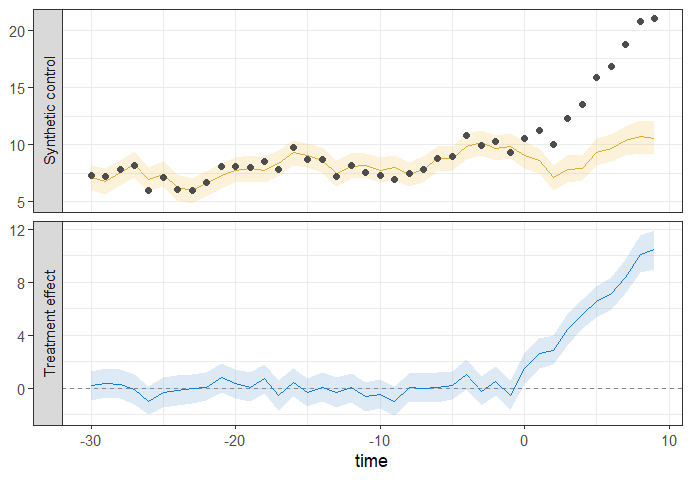

# bscm

<!-- badges: start -->
[](https://app.codecov.io/gh/helske/bscm)
[](https://github.com/helske/bscm/actions/workflows/R-CMD-check.yaml)
<!-- badges: end -->

R package for Bayesian Synthetic Control Models (Helske 2026, in-preparation). 


## Installation

You can install the development version of `bscm` as

``` r
remotes::install_github("helske/bscm")
```

## Example

``` r
library(bscm)
set.seed(3546)
fit <- bscm(
    y ~ x, data = simulated_data, 
    treatment = "treatment",  time = "time",  unit = "id"
)
```
Basic summary of the estimated model:
``` r
> fit
Call:
bscm(formula = y ~ x, data = simulated_data, treatment = "treatment", 
    time = "time", unit = "id")

Bayesian synthetic control model y ~ x
Treated unit: 1 
Number of donors: 30 
Number of time periods (pre + post): 40 + 10 
MCMC sampling time: 1.608 seconds

MCMC diagnostics indicate no major issues. 

  variable                     mean     sd   q2.5  q97.5  rhat ess_bulk ess_tail
1 Intercept                   0.505 0.183   0.149  0.864 1.00     6070.    3159.
2 Coef_x                      1.23  0.0819  1.07   1.39  1.00     6665.    2973.
3 Residual SD                 1.02  0.127   0.809  1.31  1.00     5930.    2867.
4 Treatment effect at time 0 -0.238 1.07   -2.35   1.92  1.000    4168.    3889.
5 Average treatment effect    1.63  0.370   0.923  2.37  1.00     4552.    3780.
6 Number of effective donors 15.7   2.37   10.7   20.1   1.00     2284.    2911.
7 Pre-RMSE                    1.42  0.172   1.12   1.79  1.000    4004.    3586.
8 Post-RMSE                   2.28  0.354   1.61   3.01  1.00     4235.    3790.
9 Bayesian R^2                0.956 0.0106  0.931  0.972 1.00     5894.    2685.
```
And default visualization:
``` r
plot(fit)
```

