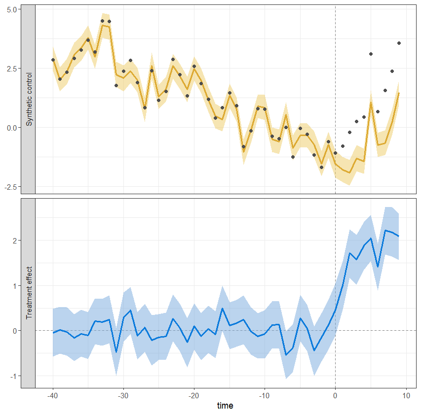

# bscm

<!-- badges: start -->
<!-- badges: end -->

R package for Bayesian Synthetic Control Models (Helske 2026, in-preparation). 


## Installation

You can install the development version of `bscm` as

``` r
remotes::install_github("helske/bscm")
```

## Example

``` r
library(bscm)
set.seed(3546)
fit <- bscm(
    y ~ x2, data = simulated_example, 
    treatment = "treatment",  time = "time",  unit = "id", 
    time_varying_effects = "intercept",
    chains = 4, cores = 4
)
```
Basic summary of the estimated model:
``` r
> fit
Call:
bscm(formula = y ~ x2, data = simulated_example, treatment = "treatment", 
    time = "time", unit = "id", time_varying_effects = "intercept", 
    chains = 4, cores = 4)

Bayesian synthetic control model y ~ x2 with time-varying intercept 
Treated unit: id_1 
Number of donors: 30 
Number of time periods (pre + post): 40 + 10 

MCMC diagnostics indicate no major issues:
         diagnostic    variable  rhat ess_bulk ess_tail
1      Largest Rhat sigma_delta 1.002     2298     4557
2 Smallest bulk-ESS        lp__ 1.002     1935     4321
3 Smallest tail-ESS    omega[4] 1.000     6206     3983

Posterior summary of main model parameters (excluding weights):
  variable   mean     sd  q2.5 q97.5  rhat ess_bulk ess_tail
1 Intercept 0.857 0.0584 0.744 0.972  1.00    7447.    7108.
2 Coef_x2   0.497 0.0151 0.467 0.527  1.00   11606.    7597.
3 SD_noise  0.250 0.0328 0.196 0.324  1.00   10363.    7143.
4 SD_spline 1.96  0.266  1.50  2.54   1.00    2298.    4557.

RMSE and Bayesian R^2 values:
  variable   mean      sd  q2.5 q97.5  rhat ess_bulk ess_tail
1 Pre-RMSE  0.348 0.0454  0.268 0.447 1.00     9492.    8502.
2 Post-RMSE 1.76  0.0910  1.58  1.93  1.000   11033.   10038.
3 R^2       0.978 0.00604 0.964 0.987 1.00    10484.    7209.
```
And default visualization:
``` r
plot(fit)
```
